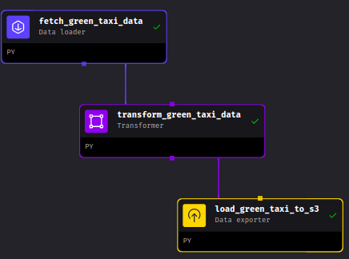
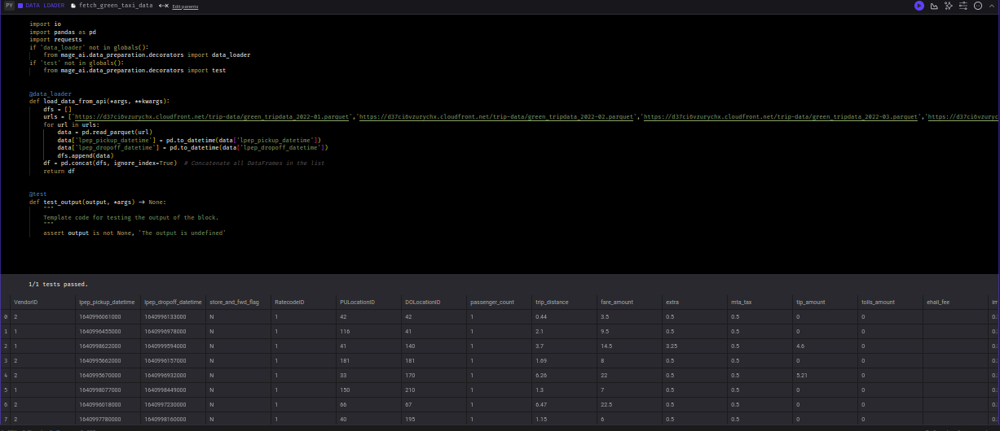
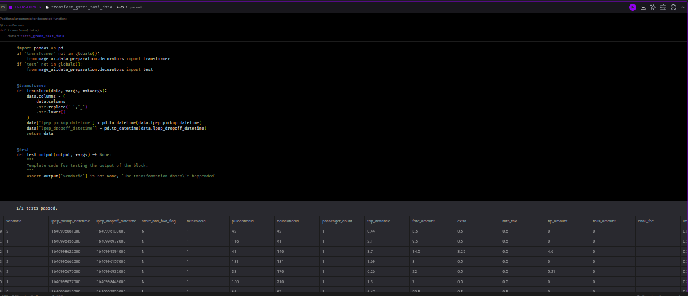
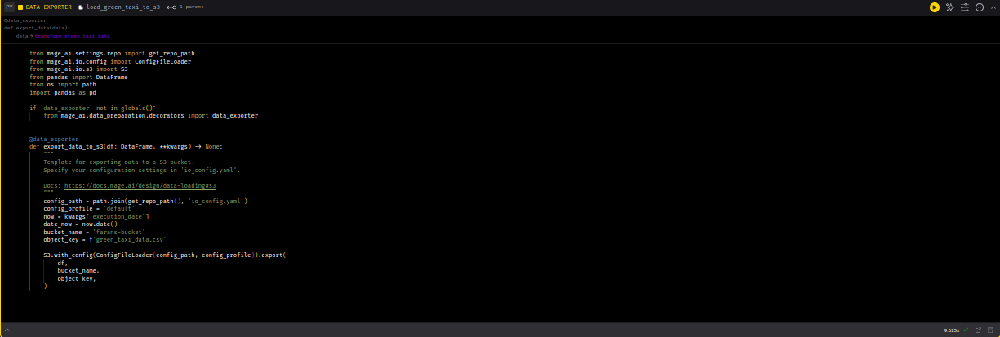
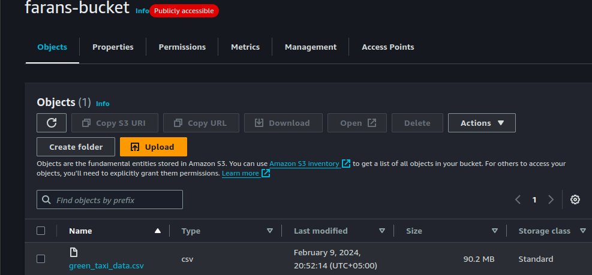
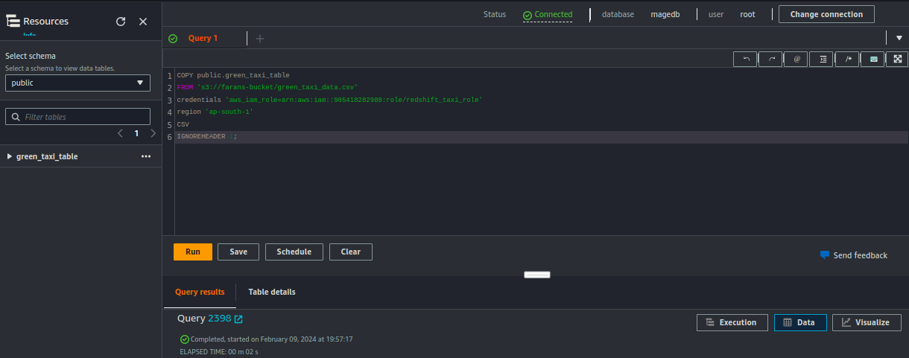
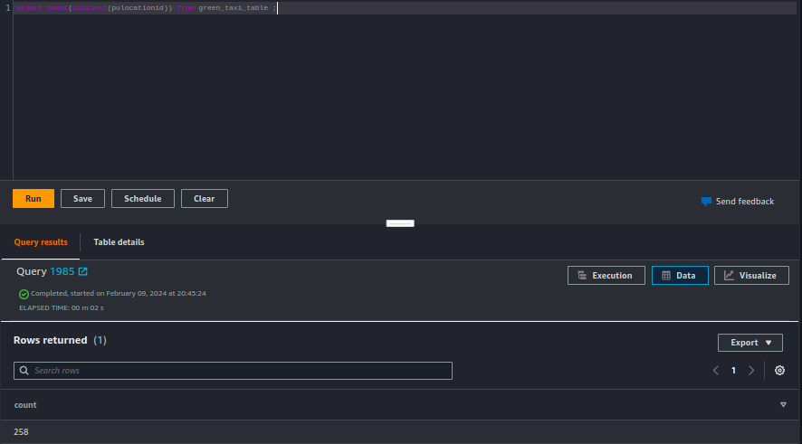
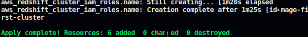
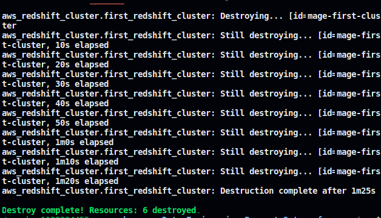

# Data-Engineering-Project-2
Data Engineering Project made with AWS, Mage ,Terraform  &amp; Docker

## Mage Pipeline:

## Data Extracted from  Newyork Taxi Data

## Data Transformed

## Data Loaded to S3 Bucket

## Loaded data in S3 Bucket

## Data Loaded to Redshift from S3

## Quering from Redshift for Distinct PUlocationID

## Infrastructure created & destroyed using terraform 

